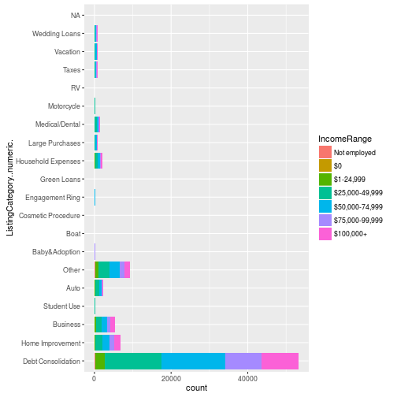
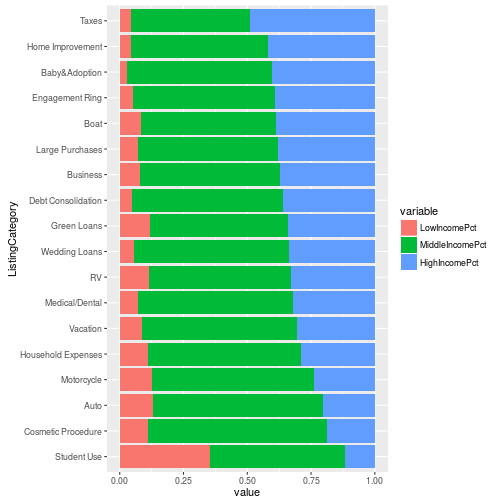

# P6: Exploring Prosper Loan Dataset
Author: Ying Wu

# Introduction
Prosper is a company that offers a marketplace for peer to peer lending.
Individuals can request loans and Prosper will calculate a score value
indicating the risk of the loan the individual is asking for and then 
add that loan into their system. Investors can choose the type of loans 
that they would want to get exposure to allowing them to trade off risk 
for return.

My goal is to pick out an interesting facet of this loan data and explore
it further using a d3.js visualization.

# Exploration

Looking through the variable definitions, I was most intrigued by the categories.
I exploring the relationship between these categories and the rest of the 
variables available in the Prosper loan data.


```r
library(data.table)
library(ggplot2)
# dt = fread("prosperLoanData.csv") # everything is character
df = read.table("prosperLoanData.csv", header=T, sep=",")
dt = as.data.table(df)
rm(df)

dt$ListingNumber = as.factor(dt$ListingNumber)
dt$ListingCreationDate = as.POSIXct(dt$ListingCreationDate)
dt$Term = as.factor(dt$Term)
dt$ClosedDate = as.Date(dt$ClosedDate)
dt$ListingCategory..numeric. = factor(dt$ListingCategory..numeric.)
levels(dt$ListingCategory..numeric.) = c(NA, "Debt Consolidation", "Home Improvement", "Business", "Personal Loan", 
  "Student Use", "Auto", "Other", "Baby&Adoption", "Boat", "Cosmetic Procedure",
  "Engagement Ring", "Green Loans", "Household Expenses", "Large Purchases",
  "Medical/Dental", "Motorcycle", "RV", "Taxes", "Vacation", "Wedding Loans")
dt$DateCreditPulled = as.POSIXct(dt$DateCreditPulled)
dt$FirstRecordedCreditLine = as.Date(dt$FirstRecordedCreditLine)
dt$LoanOriginationDate = as.Date(dt$LoanOriginationDate)

dt$IncomeRange = ordered(dt$IncomeRange, levels(dt$IncomeRange)[c(8, 1, 3, 4, 5, 6, 2, 7)])

summary(dt)
```

```
##                    ListingKey     ListingNumber   
##  17A93590655669644DB4C06:     6   951186 :     6  
##  349D3587495831350F0F648:     4   882888 :     4  
##  47C1359638497431975670B:     4   892845 :     4  
##  8474358854651984137201C:     4   1056749:     4  
##  DE8535960513435199406CE:     4   1057901:     4  
##  04C13599434217079754AEE:     3   875616 :     3  
##  (Other)                :113912   (Other):113912  
##  ListingCreationDate            CreditGrade    Term      
##  Min.   :2005-11-09 20:44:28          :84984   12: 1614  
##  1st Qu.:2008-09-19 10:02:14   C      : 5649   36:87778  
##  Median :2012-06-16 12:37:19   D      : 5153   60:24545  
##  Mean   :2011-07-09 08:30:35   B      : 4389             
##  3rd Qu.:2013-09-09 19:40:48   AA     : 3509             
##  Max.   :2014-03-10 12:20:53   HR     : 3508             
##                                (Other): 6745             
##                  LoanStatus      ClosedDate          BorrowerAPR     
##  Current              :56576   Min.   :2005-11-25   Min.   :0.00653  
##  Completed            :38074   1st Qu.:2009-07-14   1st Qu.:0.15629  
##  Chargedoff           :11992   Median :2011-04-05   Median :0.20976  
##  Defaulted            : 5018   Mean   :2011-03-07   Mean   :0.21883  
##  Past Due (1-15 days) :  806   3rd Qu.:2013-01-30   3rd Qu.:0.28381  
##  Past Due (31-60 days):  363   Max.   :2014-03-10   Max.   :0.51229  
##  (Other)              : 1108   NA's   :58848        NA's   :25       
##   BorrowerRate     LenderYield      EstimatedEffectiveYield
##  Min.   :0.0000   Min.   :-0.0100   Min.   :-0.183         
##  1st Qu.:0.1340   1st Qu.: 0.1242   1st Qu.: 0.116         
##  Median :0.1840   Median : 0.1730   Median : 0.162         
##  Mean   :0.1928   Mean   : 0.1827   Mean   : 0.169         
##  3rd Qu.:0.2500   3rd Qu.: 0.2400   3rd Qu.: 0.224         
##  Max.   :0.4975   Max.   : 0.4925   Max.   : 0.320         
##                                     NA's   :29084          
##  EstimatedLoss   EstimatedReturn  ProsperRating..numeric.
##  Min.   :0.005   Min.   :-0.183   Min.   :1.000          
##  1st Qu.:0.042   1st Qu.: 0.074   1st Qu.:3.000          
##  Median :0.072   Median : 0.092   Median :4.000          
##  Mean   :0.080   Mean   : 0.096   Mean   :4.072          
##  3rd Qu.:0.112   3rd Qu.: 0.117   3rd Qu.:5.000          
##  Max.   :0.366   Max.   : 0.284   Max.   :7.000          
##  NA's   :29084   NA's   :29084    NA's   :29084          
##  ProsperRating..Alpha.  ProsperScore        ListingCategory..numeric.
##         :29084         Min.   : 1.00   Debt Consolidation:58308      
##  C      :18345         1st Qu.: 4.00   Other             :10494      
##  B      :15581         Median : 6.00   Home Improvement  : 7433      
##  A      :14551         Mean   : 5.95   Business          : 7189      
##  D      :14274         3rd Qu.: 8.00   Auto              : 2572      
##  E      : 9795         Max.   :11.00   (Other)           :10976      
##  (Other):12307         NA's   :29084   NA's              :16965      
##  BorrowerState                      Occupation         EmploymentStatus
##  CA     :14717   Other                   :28617   Employed     :67322  
##  TX     : 6842   Professional            :13628   Full-time    :26355  
##  NY     : 6729   Computer Programmer     : 4478   Self-employed: 6134  
##  FL     : 6720   Executive               : 4311   Not available: 5347  
##  IL     : 5921   Teacher                 : 3759   Other        : 3806  
##         : 5515   Administrative Assistant: 3688                : 2255  
##  (Other):67493   (Other)                 :55456   (Other)      : 2718  
##  EmploymentStatusDuration IsBorrowerHomeowner CurrentlyInGroup
##  Min.   :  0.00           False:56459         False:101218    
##  1st Qu.: 26.00           True :57478         True : 12719    
##  Median : 67.00                                               
##  Mean   : 96.07                                               
##  3rd Qu.:137.00                                               
##  Max.   :755.00                                               
##  NA's   :7625                                                 
##                     GroupKey      DateCreditPulled             
##                         :100596   Min.   :2005-11-09 00:30:04  
##  783C3371218786870A73D20:  1140   1st Qu.:2008-09-16 22:25:27  
##  3D4D3366260257624AB272D:   916   Median :2012-06-17 07:52:34  
##  6A3B336601725506917317E:   698   Mean   :2011-07-09 15:51:53  
##  FEF83377364176536637E50:   611   3rd Qu.:2013-09-11 14:30:24  
##  C9643379247860156A00EC0:   342   Max.   :2014-03-10 12:20:56  
##  (Other)                :  9634                                
##  CreditScoreRangeLower CreditScoreRangeUpper FirstRecordedCreditLine
##  Min.   :  0.0         Min.   : 19.0         Min.   :1947-08-24     
##  1st Qu.:660.0         1st Qu.:679.0         1st Qu.:1990-06-01     
##  Median :680.0         Median :699.0         Median :1995-11-01     
##  Mean   :685.6         Mean   :704.6         Mean   :1994-11-17     
##  3rd Qu.:720.0         3rd Qu.:739.0         3rd Qu.:2000-03-14     
##  Max.   :880.0         Max.   :899.0         Max.   :2012-12-22     
##  NA's   :591           NA's   :591           NA's   :697            
##  CurrentCreditLines OpenCreditLines TotalCreditLinespast7years
##  Min.   : 0.00      Min.   : 0.00   Min.   :  2.00            
##  1st Qu.: 7.00      1st Qu.: 6.00   1st Qu.: 17.00            
##  Median :10.00      Median : 9.00   Median : 25.00            
##  Mean   :10.32      Mean   : 9.26   Mean   : 26.75            
##  3rd Qu.:13.00      3rd Qu.:12.00   3rd Qu.: 35.00            
##  Max.   :59.00      Max.   :54.00   Max.   :136.00            
##  NA's   :7604       NA's   :7604    NA's   :697               
##  OpenRevolvingAccounts OpenRevolvingMonthlyPayment InquiriesLast6Months
##  Min.   : 0.00         Min.   :    0.0             Min.   :  0.000     
##  1st Qu.: 4.00         1st Qu.:  114.0             1st Qu.:  0.000     
##  Median : 6.00         Median :  271.0             Median :  1.000     
##  Mean   : 6.97         Mean   :  398.3             Mean   :  1.435     
##  3rd Qu.: 9.00         3rd Qu.:  525.0             3rd Qu.:  2.000     
##  Max.   :51.00         Max.   :14985.0             Max.   :105.000     
##                                                    NA's   :697         
##  TotalInquiries    CurrentDelinquencies AmountDelinquent  
##  Min.   :  0.000   Min.   : 0.0000      Min.   :     0.0  
##  1st Qu.:  2.000   1st Qu.: 0.0000      1st Qu.:     0.0  
##  Median :  4.000   Median : 0.0000      Median :     0.0  
##  Mean   :  5.584   Mean   : 0.5921      Mean   :   984.5  
##  3rd Qu.:  7.000   3rd Qu.: 0.0000      3rd Qu.:     0.0  
##  Max.   :379.000   Max.   :83.0000      Max.   :463881.0  
##  NA's   :1159      NA's   :697          NA's   :7622      
##  DelinquenciesLast7Years PublicRecordsLast10Years
##  Min.   : 0.000          Min.   : 0.0000         
##  1st Qu.: 0.000          1st Qu.: 0.0000         
##  Median : 0.000          Median : 0.0000         
##  Mean   : 4.155          Mean   : 0.3126         
##  3rd Qu.: 3.000          3rd Qu.: 0.0000         
##  Max.   :99.000          Max.   :38.0000         
##  NA's   :990             NA's   :697             
##  PublicRecordsLast12Months RevolvingCreditBalance BankcardUtilization
##  Min.   : 0.000            Min.   :      0        Min.   :0.000      
##  1st Qu.: 0.000            1st Qu.:   3121        1st Qu.:0.310      
##  Median : 0.000            Median :   8549        Median :0.600      
##  Mean   : 0.015            Mean   :  17599        Mean   :0.561      
##  3rd Qu.: 0.000            3rd Qu.:  19521        3rd Qu.:0.840      
##  Max.   :20.000            Max.   :1435667        Max.   :5.950      
##  NA's   :7604              NA's   :7604           NA's   :7604       
##  AvailableBankcardCredit  TotalTrades    
##  Min.   :     0          Min.   :  0.00  
##  1st Qu.:   880          1st Qu.: 15.00  
##  Median :  4100          Median : 22.00  
##  Mean   : 11210          Mean   : 23.23  
##  3rd Qu.: 13180          3rd Qu.: 30.00  
##  Max.   :646285          Max.   :126.00  
##  NA's   :7544            NA's   :7544    
##  TradesNeverDelinquent..percentage. TradesOpenedLast6Months
##  Min.   :0.000                      Min.   : 0.000         
##  1st Qu.:0.820                      1st Qu.: 0.000         
##  Median :0.940                      Median : 0.000         
##  Mean   :0.886                      Mean   : 0.802         
##  3rd Qu.:1.000                      3rd Qu.: 1.000         
##  Max.   :1.000                      Max.   :20.000         
##  NA's   :7544                       NA's   :7544           
##  DebtToIncomeRatio         IncomeRange    IncomeVerifiable
##  Min.   : 0.000    $25,000-49,999:32192   False:  8669    
##  1st Qu.: 0.140    $50,000-74,999:31050   True :105268    
##  Median : 0.220    $100,000+     :17337                   
##  Mean   : 0.276    $75,000-99,999:16916                   
##  3rd Qu.: 0.320    Not displayed : 7741                   
##  Max.   :10.010    $1-24,999     : 7274                   
##  NA's   :8554      (Other)       : 1427                   
##  StatedMonthlyIncome                    LoanKey       TotalProsperLoans
##  Min.   :      0     CB1B37030986463208432A1:     6   Min.   :0.00     
##  1st Qu.:   3200     2DEE3698211017519D7333F:     4   1st Qu.:1.00     
##  Median :   4667     9F4B37043517554537C364C:     4   Median :1.00     
##  Mean   :   5608     D895370150591392337ED6D:     4   Mean   :1.42     
##  3rd Qu.:   6825     E6FB37073953690388BC56D:     4   3rd Qu.:2.00     
##  Max.   :1750003     0D8F37036734373301ED419:     3   Max.   :8.00     
##                      (Other)                :113912   NA's   :91852    
##  TotalProsperPaymentsBilled OnTimeProsperPayments
##  Min.   :  0.00             Min.   :  0.00       
##  1st Qu.:  9.00             1st Qu.:  9.00       
##  Median : 16.00             Median : 15.00       
##  Mean   : 22.93             Mean   : 22.27       
##  3rd Qu.: 33.00             3rd Qu.: 32.00       
##  Max.   :141.00             Max.   :141.00       
##  NA's   :91852              NA's   :91852        
##  ProsperPaymentsLessThanOneMonthLate ProsperPaymentsOneMonthPlusLate
##  Min.   : 0.00                       Min.   : 0.00                  
##  1st Qu.: 0.00                       1st Qu.: 0.00                  
##  Median : 0.00                       Median : 0.00                  
##  Mean   : 0.61                       Mean   : 0.05                  
##  3rd Qu.: 0.00                       3rd Qu.: 0.00                  
##  Max.   :42.00                       Max.   :21.00                  
##  NA's   :91852                       NA's   :91852                  
##  ProsperPrincipalBorrowed ProsperPrincipalOutstanding
##  Min.   :    0            Min.   :    0              
##  1st Qu.: 3500            1st Qu.:    0              
##  Median : 6000            Median : 1627              
##  Mean   : 8472            Mean   : 2930              
##  3rd Qu.:11000            3rd Qu.: 4127              
##  Max.   :72499            Max.   :23451              
##  NA's   :91852            NA's   :91852              
##  ScorexChangeAtTimeOfListing LoanCurrentDaysDelinquent
##  Min.   :-209.00             Min.   :   0.0           
##  1st Qu.: -35.00             1st Qu.:   0.0           
##  Median :  -3.00             Median :   0.0           
##  Mean   :  -3.22             Mean   : 152.8           
##  3rd Qu.:  25.00             3rd Qu.:   0.0           
##  Max.   : 286.00             Max.   :2704.0           
##  NA's   :95009                                        
##  LoanFirstDefaultedCycleNumber LoanMonthsSinceOrigination   LoanNumber    
##  Min.   : 0.00                 Min.   :  0.0              Min.   :     1  
##  1st Qu.: 9.00                 1st Qu.:  6.0              1st Qu.: 37332  
##  Median :14.00                 Median : 21.0              Median : 68599  
##  Mean   :16.27                 Mean   : 31.9              Mean   : 69444  
##  3rd Qu.:22.00                 3rd Qu.: 65.0              3rd Qu.:101901  
##  Max.   :44.00                 Max.   :100.0              Max.   :136486  
##  NA's   :96985                                                            
##  LoanOriginalAmount LoanOriginationDate  LoanOriginationQuarter
##  Min.   : 1000      Min.   :2005-11-15   Q4 2013:14450         
##  1st Qu.: 4000      1st Qu.:2008-10-02   Q1 2014:12172         
##  Median : 6500      Median :2012-06-26   Q3 2013: 9180         
##  Mean   : 8337      Mean   :2011-07-21   Q2 2013: 7099         
##  3rd Qu.:12000      3rd Qu.:2013-09-18   Q3 2012: 5632         
##  Max.   :35000      Max.   :2014-03-12   Q2 2012: 5061         
##                                          (Other):60343         
##                    MemberKey      MonthlyLoanPayment LP_CustomerPayments
##  63CA34120866140639431C9:     9   Min.   :   0.0     Min.   :   -2.35   
##  16083364744933457E57FB9:     8   1st Qu.: 131.6     1st Qu.: 1005.76   
##  3A2F3380477699707C81385:     8   Median : 217.7     Median : 2583.83   
##  4D9C3403302047712AD0CDD:     8   Mean   : 272.5     Mean   : 4183.08   
##  739C338135235294782AE75:     8   3rd Qu.: 371.6     3rd Qu.: 5548.40   
##  7E1733653050264822FAA3D:     8   Max.   :2251.5     Max.   :40702.39   
##  (Other)                :113888                                         
##  LP_CustomerPrincipalPayments LP_InterestandFees LP_ServiceFees   
##  Min.   :    0.0              Min.   :   -2.35   Min.   :-664.87  
##  1st Qu.:  500.9              1st Qu.:  274.87   1st Qu.: -73.18  
##  Median : 1587.5              Median :  700.84   Median : -34.44  
##  Mean   : 3105.5              Mean   : 1077.54   Mean   : -54.73  
##  3rd Qu.: 4000.0              3rd Qu.: 1458.54   3rd Qu.: -13.92  
##  Max.   :35000.0              Max.   :15617.03   Max.   :  32.06  
##                                                                   
##  LP_CollectionFees  LP_GrossPrincipalLoss LP_NetPrincipalLoss
##  Min.   :-9274.75   Min.   :  -94.2       Min.   : -954.5    
##  1st Qu.:    0.00   1st Qu.:    0.0       1st Qu.:    0.0    
##  Median :    0.00   Median :    0.0       Median :    0.0    
##  Mean   :  -14.24   Mean   :  700.4       Mean   :  681.4    
##  3rd Qu.:    0.00   3rd Qu.:    0.0       3rd Qu.:    0.0    
##  Max.   :    0.00   Max.   :25000.0       Max.   :25000.0    
##                                                              
##  LP_NonPrincipalRecoverypayments PercentFunded    Recommendations   
##  Min.   :    0.00                Min.   :0.7000   Min.   : 0.00000  
##  1st Qu.:    0.00                1st Qu.:1.0000   1st Qu.: 0.00000  
##  Median :    0.00                Median :1.0000   Median : 0.00000  
##  Mean   :   25.14                Mean   :0.9986   Mean   : 0.04803  
##  3rd Qu.:    0.00                3rd Qu.:1.0000   3rd Qu.: 0.00000  
##  Max.   :21117.90                Max.   :1.0125   Max.   :39.00000  
##                                                                     
##  InvestmentFromFriendsCount InvestmentFromFriendsAmount   Investors      
##  Min.   : 0.00000           Min.   :    0.00            Min.   :   1.00  
##  1st Qu.: 0.00000           1st Qu.:    0.00            1st Qu.:   2.00  
##  Median : 0.00000           Median :    0.00            Median :  44.00  
##  Mean   : 0.02346           Mean   :   16.55            Mean   :  80.48  
##  3rd Qu.: 0.00000           3rd Qu.:    0.00            3rd Qu.: 115.00  
##  Max.   :33.00000           Max.   :25000.00            Max.   :1189.00  
## 
```

Some data summaries and reading online reveals that Prosper changed their API in
the latter half of 2009. In order to have the most consistant dataset, I exclude
data from before this period. I believe the most interesting comparison with 
ListingCategory is the IncomeRange of the inviduals asking for the loan


```r
table(dt[ListingCreationDate > "2009-07-01"]$ListingCategory..numeric., dt[ListingCreationDate > "2009-07-01"]$IncomeRange)
```

```
##                     
##                      Not employed    $0 $1-24,999 $25,000-49,999
##   Debt Consolidation          247    14      2339          14817
##   Home Improvement             29     3       262           1682
##   Business                     87    16       321           1481
##   Personal Loan                 0     0         0              0
##   Student Use                  19     1        77             90
##   Auto                         24     0       272            885
##   Other                       140    10       857           2953
##   Baby&Adoption                 1     0         5             54
##   Boat                          1     0         6             17
##   Cosmetic Procedure            1     0         9             36
##   Engagement Ring               4     0         7             56
##   Green Loans                   2     0         5             15
##   Household Expenses           56     0       166            641
##   Large Purchases               6     0        56            236
##   Medical/Dental               16     1        92            484
##   Motorcycle                    0     0        38             94
##   RV                            0     0         6             11
##   Taxes                         4     0        36            163
##   Vacation                      8     0        59            239
##   Wedding Loans                 3     0        41            213
##                     
##                      $50,000-74,999 $75,000-99,999 $100,000+ Not displayed
##   Debt Consolidation          16721           9417      9625             0
##   Home Improvement             1989           1229      1607             0
##   Business                     1417            885      1091             0
##   Personal Loan                   0              0         0             0
##   Student Use                    55             17        15             0
##   Auto                          604            258       194             0
##   Other                        2545           1406      1307             0
##   Baby&Adoption                  59             28        52             0
##   Boat                           28             17        16             0
##   Cosmetic Procedure             28             13         4             0
##   Engagement Ring                65             35        50             0
##   Green Loans                    17             10        10             0
##   Household Expenses            556            304       273             0
##   Large Purchases               247            136       195             0
##   Medical/Dental                441            248       240             0
##   Motorcycle                     99             32        41             0
##   RV                             18              7        10             0
##   Taxes                         250            180       252             0
##   Vacation                      227            141        94             0
##   Wedding Loans                 255            134       125             0
```

```r
ggplot(dt[ListingCreationDate > "2009-07-01"], aes(ListingCategory..numeric., fill = IncomeRange)) + geom_bar() + coord_flip()
```



```r
setnames(dt, "ListingCategory..numeric.", "ListingCategory")
```

merge income ranges and summarize

```r
tmp = dt[ListingCreationDate > "2009-07-01", list(Total = .N), by = list(ListingCategory, IncomeRange)]
out = dcast(tmp, ListingCategory ~ IncomeRange, value.var = "Total", fill = 0)
out$LowIncome = out$"Not employed" + out$"$0" + out$"$1-24,999"
out$MiddleIncome = out$"$25,000-49,999" + out$"$50,000-74,999"
out$HighIncome = out$"$75,000-99,999" + out$"$100,000+"
out[, Total := LowIncome + MiddleIncome + HighIncome]
out[, LowIncomePct := round(LowIncome / Total, 3)]
out[, MiddleIncomePct := round(MiddleIncome / Total, 3)]
out[, HighIncomePct := 1 - MiddleIncomePct - LowIncomePct] # so all sum to 1
out = out[ListingCategory != "Other"] # remove NA and "Other" since uninformative
setorder(out, HighIncomePct)
out$ListingCategory = factor(out$ListingCategory, levels = as.character(out$ListingCategory)) # reorder

ggplot(melt(out, id.vars = "ListingCategory", measure.vars = c("LowIncomePct", "MiddleIncomePct", "HighIncomePct")), 
	aes(ListingCategory, value, fill = variable)) + geom_bar(stat = 'identity') + coord_flip()
```



write out the data

```r
# cleanup
out = out[, .(ListingCategory, LowIncomePct, MiddleIncomePct, HighIncomePct, Total)]
setnames(out, c("ListingCategory", "LowIncome <$25k", "MiddleIncome", "HighIncome >$75k", "Total"))
write.csv(out, file = "data.csv", row.names = FALSE)
```

# Summary
Thinking from a perspective of an affliate advertiser, my goal is to identify 
target audiences that might be interested in lending using Prosper based off
historical loan data. To achieve this, I identified two interesting variables
in the Prosper dataset: ListingCategory and IncomeRange. The former provides
good sites to place ads for Prosper whereas the latter can be used to filter
the customers to target these advertisements for.

Based on the data, I found that the following class of individuals 
would be a good target for Prosper ads:
- Low income students
- Middle income looking for cosmetic procedures
- High income in months before taxes being due

These three categories are specific to each income category. Sorting by
high income: Taxes have the highest percentage while Cosmetic Procedure
and Student Use are the lowest. Sorting by middle income: Cosmetic Procedure
had the highest percentage while Student Use and Taxes were the lowest.
Sorting by low income: Student Use by far had the highest percentage
with Taxes near the bottom and Cosmetic Procedure in the middle.

# Design
I used a proportional stacked bar chart to show the number of loans for a 
given category and IncomeRange. The IncomeRange is encoded using different 
colors in a gradient to show the ordinal nature of this variable.

For interactive component, I added in a mouseover tooltip on the Y-axis to 
allow the user to see how many elements there were total. In addition, another
mouseover showed the percentage of every income class.

After collecting feedback on the initial version, I realized that I needed a
better mechanism to emphasize the differences between the income classes. I added
a dropdown menu to sort by different income classes to emphasize the differences
between income classes. Additionally, I bolded the categories of interest and
I sorted by Low income by default since "Student Use" had the most striking 
example of percentage overrepresentation by income class.

# Feedback

I asked the following questions and wrote down the respones below:

- What do you notice in the visualization?
- What questions do you have about the data?
- What relationships do you notice?
- What do you think is the main takeaway from this visualization?
- Is there something you don’t understand in the graphic?

## Feedback 1 - Lynn

Poor students are one of the highest proportions.

Could you sort by the other income classes too (low and middle)?

Middle income seems to dominate Cosmetic Procedure and transportation related
(Auto and Motorcycle).

Poor students would be a good target for Prosper advertisements.

I understand the graphic.

## Feedback 2 - Jamie
Middle income has the largest % of loans

Could you also show the dollar amount of each loan?

Low income have disporportionately high student loans

I understand the graphic.

## Feedback 3 - Jo

The difference between what poor people ask for loans on and what rich people
ask for loans on is quite big.

Could you sort by low income instead of high?

Why students getting loans from Prosper rather than regular student loans.

Low income is more likely to use prosper for student loans. Middle income for 
status symbol items like beauty, and cars. High income for home improvement or taxes.

I understand the graphic. 

# Resources
https://developers.prosper.com/docs/investor/loans-api/

http://square.github.io/intro-to-d3/

https://github.com/d3/d3/wiki/

https://bl.ocks.org/mbostock/3886208 

https://github.com/d3/d3/blob/master/API.md

various stackoverflow and plnkr/jsfiddle/bl.ocks examples
